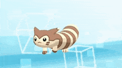

# Hoenn Music Mixer

A music mixer featuring tracks from Pokemon Emerald and Pokemon from the region.  

## Installation

TODO: Describe the installation process  

## Usage

All images used are recreations made for educational purposes only. The images are copyrighted or is a registered trademark. The contributor claims fair use. No copyright infringement is intended.  

Certain materials are included under fair use exemption of the U.S. Copyright Law and are restricted from further use.  

© 2023 Pokémon. © 1995–2023 Nintendo/Creatures Inc./GAME FREAK inc.  

## Contributing

Westrop, Sophia  

Singer, Dan  

## History

***01/06/23 (Sophia)***- Created repo  
***01/06/23 (Dan)***- Created readme, files, folders, and added image  
***01/21/23 (Dan)***- Added pixel icons to project  
***01/26/23 (Sophia)***- Added pokeball svg's and ai working file to assets  
***02/02/23 (Dan)***- Added in basic elements and styled them  
***02/05/23 (Dan)***- Added javascript to the sprites, added the Pokeballs with javascript, did a bit of spacing and styling for the elements  

## Credits

Westrop, Sophia- Co-Author  

Singer, Dan- Co-Author  

All images used are recreations made for educational purposes only. The images are copyrighted or is a registered trademark. The contributor claims fair use. No copyright infringement is intended.  

Certain materials are included under fair use exemption of the U.S. Copyright Law and are restricted from further use.  

© 2023 Pokémon. © 1995–2023 Nintendo/Creatures Inc./GAME FREAK inc.  

## License

MIT  

  